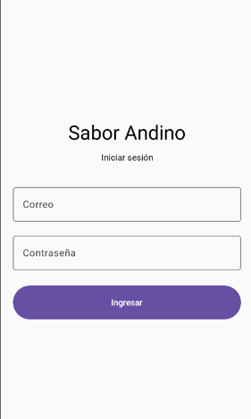
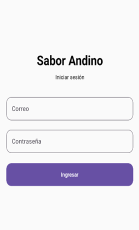
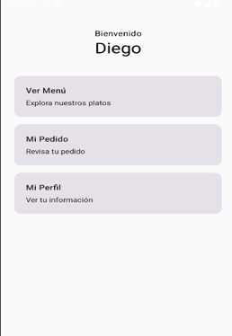
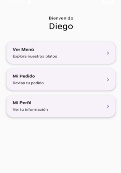
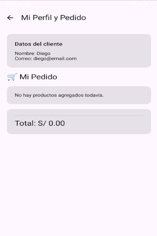
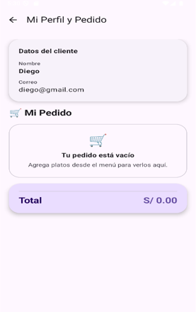

# Mejoras realizadas con apoyo de Gemini

En este documento se presentan las mejoras visuales aplicadas a la app **Sabor Andino** con apoyo de Gemini en Android Studio.

Gemini fue utilizado como herramienta de auditoría UI/UX para analizar pantallas ya creadas y sugerir mejoras visuales sin cambiar la lógica principal de la aplicación.

---

## Mejora 1: LoginScreen

### Prompt usado en Gemini

Analiza el diseño actual de esta pantalla LoginScreen hecha con Jetpack Compose y Material 3 como una auditoría UI/UX. No generes código todavía. Evalúa la jerarquía visual, espaciado, alineación, campos de texto, botón, mensaje de error, legibilidad y experiencia de usuario. Luego dame sugerencias concretas de mejora visual sin cambiar la lógica de validación.

### Captura antes

### Captura después

### Cambios aplicados

En la pantalla de login se aplicaron mejoras visuales sin modificar la validación básica ni la navegación.

Se reforzó el título principal usando `FontWeight.Bold`, se ocultó la contraseña con `PasswordVisualTransformation` y se redondearon los campos y el botón usando `RoundedCornerShape`.

### Reflexión

La sugerencia de Gemini fue útil porque ayudó a mejorar la presentación del formulario de login sin cambiar su funcionamiento.  
Solo se aplicaron cambios visuales para que la pantalla se vea más clara, moderna y ordenada.

---

## Mejora 2: HomeScreen

### Prompt usado en Gemini

Analiza el diseño actual de esta pantalla HomeScreen hecha con Jetpack Compose y Material 3 como una auditoría UI/UX. No generes código todavía. Esta pantalla funciona como un Dashboard con saludo al usuario y tarjetas de acceso rápido hacia Ver Menú, Mi Pedido y Mi Perfil. Evalúa la jerarquía visual, espaciado, alineación, legibilidad, diseño de las tarjetas, formas redondeadas, elevación, consistencia visual y experiencia de usuario. Luego dame sugerencias concretas de mejora visual sin cambiar la lógica de navegación.

### Captura antes

### Captura después

### Cambios aplicados

En la pantalla Home se mejoraron las tarjetas del dashboard.

Se cambió el diseño de las tarjetas usando `ElevatedCard`, se agregaron bordes más redondeados con `RoundedCornerShape` y se añadió una flecha visual para indicar que cada tarjeta permite navegar a otra pantalla.

### Reflexión

La sugerencia fue útil porque antes las tarjetas se veían muy planas y simples.  
Con la mejora, las opciones del dashboard se ven más modernas, claras y fáciles de identificar como elementos de navegación.

---

## Mejora 3: PerfilScreen

### Prompt usado en Gemini

Analiza el diseño actual de esta pantalla PerfilScreen hecha con Jetpack Compose y Material 3 como una auditoría UI/UX. No generes código todavía. Esta pantalla contiene el perfil del cliente y también la sección de Mi Pedido. Evalúa la jerarquía visual, separación entre perfil y pedido, espaciado, tarjetas, legibilidad, estado vacío del pedido, presentación del total, colores, alineación y experiencia de usuario. Luego dame sugerencias concretas de mejora visual sin cambiar la lógica principal.

### Captura antes

### Captura después

### Cambios aplicados

En la pantalla PerfilScreen se rediseñó la presentación del perfil y del pedido.

Se usó `ElevatedCard` para destacar los datos del cliente, se mejoró el mensaje cuando el pedido está vacío, se organizó cada plato en formato tipo recibo mostrando el subtotal a la derecha y se resaltó el total con una tarjeta de color diferente.

### Reflexión

La sugerencia de Gemini ayudó a separar mejor las secciones de perfil, pedido y total.  
Algunas ideas fueron adaptadas para mantener el diseño simple y no modificar la lógica del cálculo del pedido.

---

## Conclusión general

Gemini fue útil como apoyo para detectar mejoras visuales en las pantallas de la aplicación.

No se usó para reemplazar el desarrollo propio, sino como una guía para mejorar la interfaz manteniendo la navegación, validaciones y lógica principal de la app.